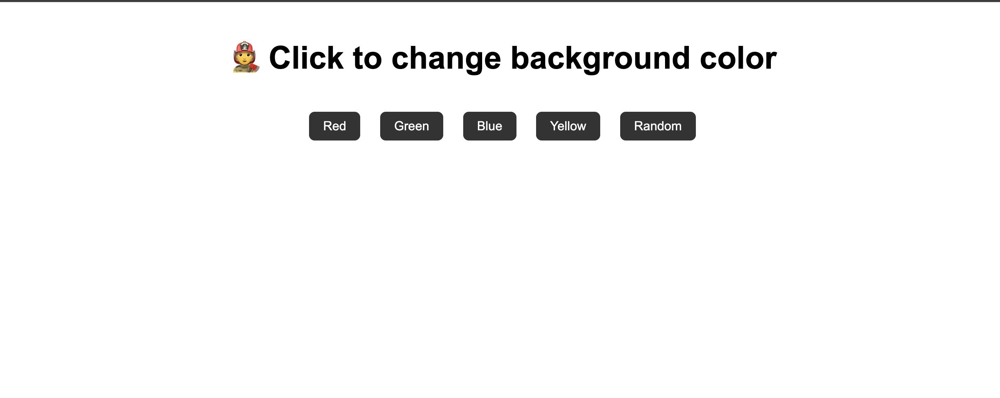

# 🎨 Random Color Generator

A simple and responsive Random Color Generator built using React.js.  
This app generates random colors instantly and changes the background dynamically.

---

## 🚀 Features

- Generate random colors 🎨
- Change background color dynamically
- Display HEX color code
- Copy color code to clipboard 📋
- Responsive design
- Simple and clean UI

---

## 🛠️ Technologies Used

- HTML
- JavaScript
- CSS

---

## 📸 Screenshots

### Home Page



---

## ⚙️ Installation

1. Clone the repository

```bash
git clone https://github.com/your-username/random-color-generator.git